# Library

A project to display information of books in card form.

# What the project is about

This project's purpose is to retrieve information from a mock database (represented in an array in this case) and display it on the browser in real time. The app allows users to remove movies from the list, toggle information to see if a book has been read or not and add books to the list.

# What have I learned so far?

This library project introduced me to the basics of object oriented programming and allowed to see first hand the benefits of splitting code for better readability. Read below what I implemented and learned.

<ul>
  <li>Implementation of CSS variables to handle dark-mode.</li>
  <li>Constructor functions to create book objects.</li>
  <li>Dynamic DOM manipulation.</li>
  <li>Real time form validation, including submission prevention.</li>
  <li>Code modularity and split responsibility in functions.</li>
</ul>

# Want to see it in action?

<a href="https://hroglardev.github.io/Library/" target="_blank">Click here</a>

# Explanation of the code

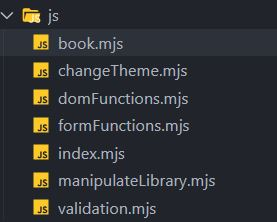
The code is split into separate files to separate concerns.

<h2>book.mjs</h2>

The function receives all the data it needs from its parameters to create a new book object.

<h2>changeTheme.mjs</h2>

The function receives an element and gets the value from its "theme" attribute. It then sets the attribute to the opposite of the previous value.

<h2>domFunctions.mjs</h2>

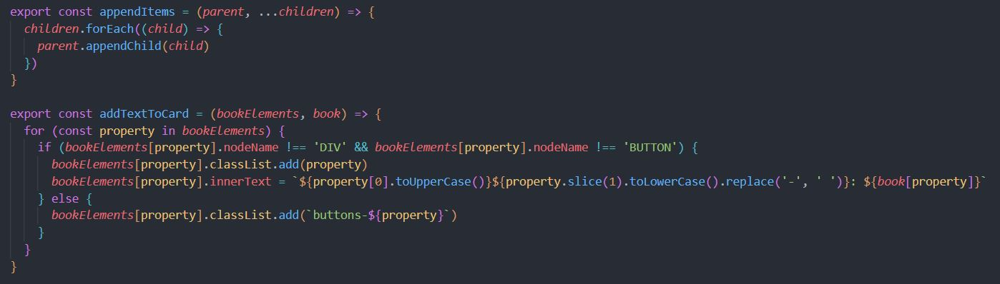

The first function is used to append items in group. It receives the parent node and an array of nodes to be appended to the parent node.

The next function is used to add text to all the items to be displayed in each card. It receives an object containing properties named after the Book constructor function. Each property creates the responsible DOM elements to be displayed. It also receives a book object.

The function loops over the object and on each iteration adds a class named after the property and sets the text of the card to initiate with uppercase and end with lowercase as long as the element is neither a div nor a button.

This is done for styling purposes.

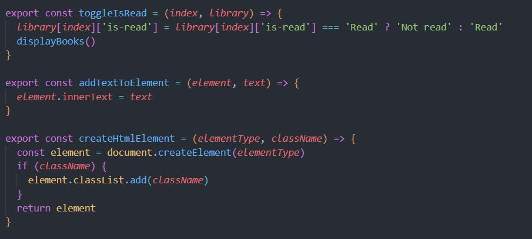

The following function takes an index to reference the card it needs to change and the library of books.

Then it reassigns the value of the "is-read" property based on current status to toggle the status.

Lastly it executes the function that redisplays the cards on the browser.

The next two functions are simply to add text to an element and to create DOM elements and assigning them a class with the same function.

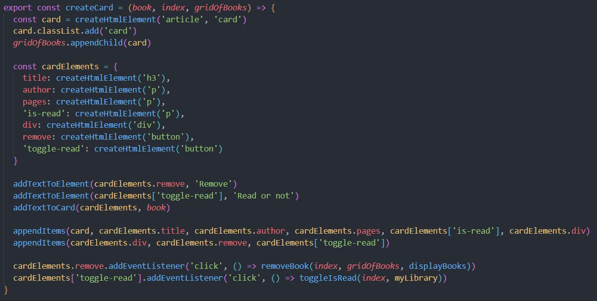

The create card receives a book object, an index for referencing and the parent grid node where all cards are to be appended.

The function creates an article DOM element and assigns it the card class using the previous functionand it appends it to the grid.

Next it declares an object that contains all the elements the card node will contain (check the addTextToCard function from before).

It adds text to both buttons and then it makes use of the addTextCard function by passing said object and the book it received as a parameter.

Following this it appends every item to the card element except for the buttons which are appended to the div element instead.

Finally it adds the provides the buttons with the functionalities to be triggered when they are clicked (check the manipulateLibrary.mjs section for the removeBook function).

<h2>formFunctions.mjs</h2>

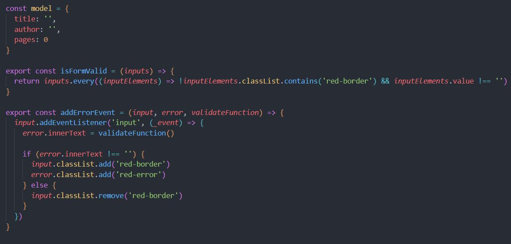

The code declares a model for a book to iterate over.

The isFormValid function iterates over every input to check if every input (only the text ones) don't have the red-border class (which would indicate the input has a mistake) and it also checks if the input is not an empty string.

Following this the addErrorEvent function takes an input node, an error node and a validation function and adds an event to the input node.

Each time the input is filled, it sets the text of the error to whatever the return value of the function is (check the validation.mjs section to see possible return values)

If the return value isn't an empty string it adds the according classes for styling both the input and the error element. If it is am empty string (no error), it removes the class.

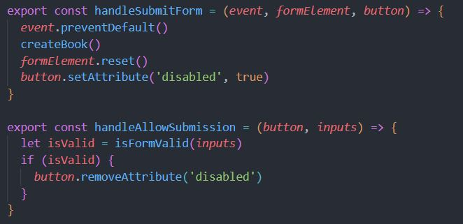

The submit form function takes an event, the form and the submit button. The form prevents the reloading of the page using the prevent default function on the event. Then it procedes to create the book (check the manipulateLibrary section for details on the function).

Finally it resets the form and sets the submit button to be disabled.

The next function handles the triggering of the button to allow remove the disabled attribute when all the inputs succeeed in passing the previous isFormValid function

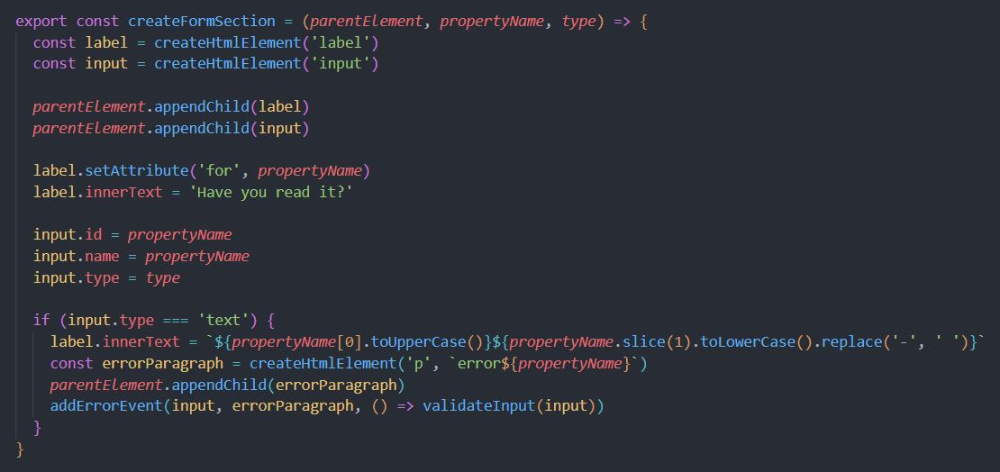

The createFormSection function receives a parent node, a property name and the type of input to be created.

It creates two elements, a label and an input and appends them to the parent node. Then it sets the for attribute for the label to be named after the property and the text to "Have you read it?" by default.

The input's id and name are also named after the property and the type is set by getting it from the function's arguments.

Lastly if the input is of text type, it swaps the labels text to be named after the property initialising with capital letter and rest lower case and replacing all dashes with blank spaces.

The if block also creates a paragraph element with a class named error and the name of the property.

It appends the paragraph to the form (right after the input) and lastly it adds the event to validate each keystroke on it.

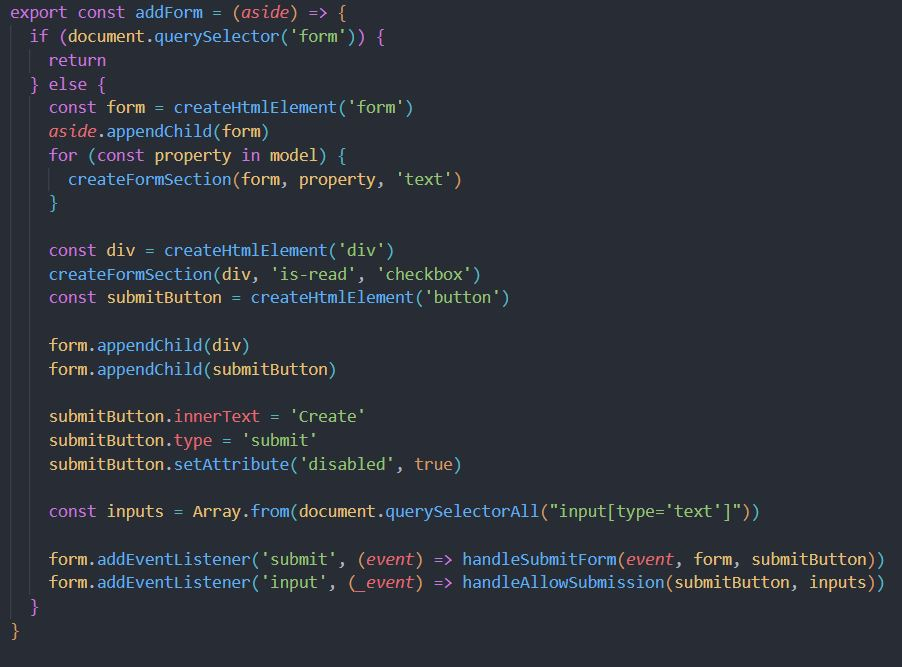

The addForm function plays a pivotal role in dynamically generating and appending a form to a specified aside element within the web page. This function ensures the uniqueness of the form by checking if there is an existing form within the document. If a form already exists, the function exits. Otherwise, it proceeds to construct and add the form.

The form is created and it is appended to the provided "aside" element. Subsequently, a series of form sections are added to the form, each corresponding to a property in the model object. These sections are created using the createFormSection function, setting the type of input as 'text' for most properties, and 'checkbox' for the 'is-read' property.

The function also creates a container div to encapsulate the 'is-read' checkbox, ensuring proper styling and organization. Within this div, the createFormSection function is invoked once again to generate the checkbox input and its associated label.

A 'Create' button is appended to the form to initiate the book creation process. This button is configured with attributes such as text content, type ('submit'), and an initial state of being disabled. The inputs array is then populated with all text-type input elements within the form.

Event listeners are set up for both form submission and input events. Upon submission, the handleSubmitForm function is called to process the form data, create a new book, and reset the form. Simultaneously, the 'Create' button's disabled attribute is updated based on the validation status of the text inputs.

<h2>manipulateLibrary.mjs</h2>

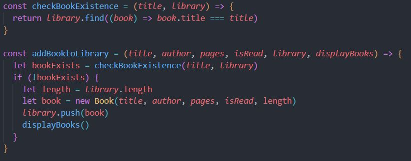

The first function checks if the book already exists in the library.

The following function receives all the data a book should have as well as the library and the displayBooks function.

First it checks if the book exists and if it doesn't then it creates a new book and pushes it into the library. Finally it redisplays all the books in the browser.

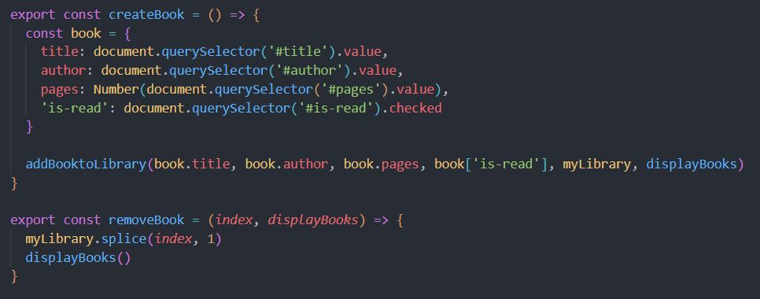

The create book function gets the value of the form inputs in an object and proceeds to add the book to the library by passing all the inputs information in the object, the library and the displayBooks function.

Finally the last function handles the deletion of the books from the library.

It takes an index and the displayBooks function. It deletes the element from the library array (starts at the index and it indicates how many elements are to be removed) and it calls the displayBooks function again to redisplay the cards in the dom.

<h2>validation.mjs</h2>

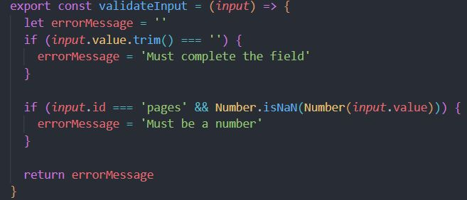

The validation function simply checks if the value is empty and in the case of the pages input, it also checks if the input's value is a number.

If either condition is not passed, it returns the appropiate message, if not it returns an empty string.

<h2>index.mjs</h2>

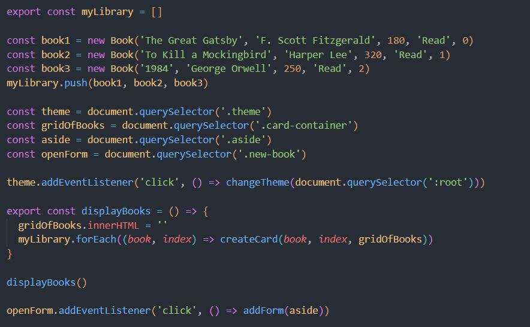

Lastly the main file initiates the library and fills it with three dummy books to be initially displayed.

Then it retreives some elements from the dom and assigns the darkmode element and the button that triggers the form their appropiate events.

It also declares the displayBooks function that clears the the grid and iterates over the library.

On each iteration it creates a card passing the book, the index and the grid as elements.

Finally it calls the function for the initial cards to be displayed.

# Want to track my progress?

Checkout my other projects in order to see my evolution:

<ol>
  <li><a href="https://github.com/hroglardev/odin-recipes" target="_blank">Recipes</a></li>
  <li><a href="https://github.com/hroglardev/Odin-landing-page" target="_blank">Landing Page</a></li>
  <li><a href="https://github.com/hroglardev/Rock-Paper-Scissors-TOP-Console" target="_blank">Console Rock, Paper, Scissors</a></li>
  <li><a href="https://github.com/hroglardev/Rock-Paper-Scissors-TOP" target="_blank">Rock, Paper, Scissors</a></li>
  <li><a href="https://github.com/hroglardev/Etch-a-Sketch" target="_blank">Etch a Sketch</a></li>
  <li><a href="https://github.com/hroglardev/Calculator" target="_blank">Calculator</a></li>
  <li><a href="https://github.com/hroglardev/Sign-up-form-TOP" target="_blank">Sign up form</a></li>
  <li><a href="https://github.com/hroglardev/Dashboard" target="_blank">Dashboard</a></li>
  <li><a href="https://github.com/hroglardev/Library" target="_blank">You are here</a></li>
  <li><a href="https://github.com/hroglardev/Tic-tac-toe" target="_blank">Tic-tac-toe</a></li>
  <li><a href="https://github.com/hroglardev/Restaurant-page" target="_blank">Restaurant page</a></li>
  <li><a href="https://github.com/hroglardev/To-do-list-js" target="_blank">To-do list</a></li>
  <li><a href="https://github.com/hroglardev/Weather-app" target="_blank">Weather app</a></li>
  <li><a href="https://github.com/hroglardev/Battleship" target="_blank">Battleship</a></li>
  <li><a href="https://github.com/hroglardev/Lucas-Cubile" target="_blank">Portfolio</a></li>
</ol>

These are all my projects in my basic section of my coding journey. I will continue with it in the React section along with back-end programming.

If you'd like to skip my basic projects and jump straight to the next section, you can jump to it in the following link.

<a href="https://github.com/hroglardev/CV-creator" target="_blank">React - Backend</a>
