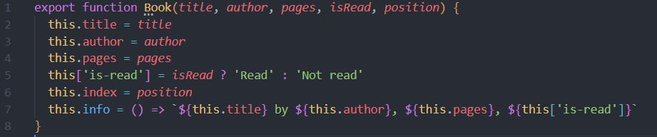
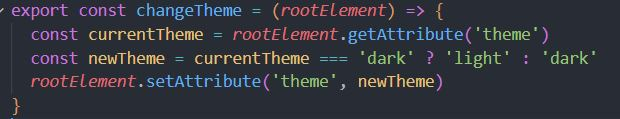

# Library

A project to display information of books in card form.

# What the project is about

This project's purpose is to retrieve information from a mock database (represented in an array in this case) and display it on the browser in real time. The app allows users to remove movies from the list, toggle information to see if a book has been read or not and add books to the list.

# What have I learned so far?

This library project introduced me to the basics of object oriented programming and allowed to see first hand the benefits of splitting code for better readability. Read below what I implemented and learned.

<ul>
  <li>Implementation of CSS variables to handle dark-mode.</li>
  <li>Constructor functions to create book objects.</li>
  <li>Dynamic DOM manipulation.</li>
  <li>Real time form validation, including submission prevention.</li>
  <li>Code modularity and split responsibility in functions.</li>
</ul>

# Explanation of the code

The code is split into separate files to separate concerns.

<h2>book.mjs</h2>

The function receives all the data it needs from its parameters to create a new book object.

<h2>changeTheme.mjs</h2>

The function receives an element and gets the value from its "theme" attribute. It then sets the attribute to the opposite of the previous value.

<h2>domFunctions.mjs</h2>

The first function is used to append items in group. It receives the parent node and an array of nodes to be appended to the parent node.

The next function is used to add text to all the items to be displayed in each card. It receives an object containing properties named after the Book constructor function. Each property creates the responsible DOM elements to be displayed. It also receives a book object.

The function loops over the object and on each iteration adds a class named after the property and sets the text of the card to initiate with uppercase and end with lowercase as long as the element is neither a div nor a button.

This is done for styling purposes.

The following function takes an index to reference the card it needs to change and the library of books.

Then it reassigns the value of the "is-read" property based on current status to toggle the status.

Lastly it executes the function that redisplays the cards on the browser.

The next two functions are simply to add text to an element and to create DOM elements and assigning them a class with the same function.

# Want to see it in action?

<a href="https://hroglardev.github.io/Library/">Click here</a>

# Want to track my progress?

Checkout my other projects in order to see my evolution:

<ol>
  <li><a href="https://github.com/hroglardev/odin-recipes" target="_blank">Recipes</a></li>
  <li><a href="https://github.com/hroglardev/Odin-landing-page" target="_blank">Landing Page</a></li>
  <li><a href="https://github.com/hroglardev/Rock-Paper-Scissors-TOP-Console" target="_blank">Console Rock, Paper, Scissors</a></li>
  <li><a href="https://github.com/hroglardev/Rock-Paper-Scissors-TOP" target="_blank">Rock, Paper, Scissors</a></li>
  <li><a href="https://github.com/hroglardev/Etch-a-Sketch" target="_blank">Etch a Sketch</a></li>
  <li><a href="https://github.com/hroglardev/Calculator" target="_blank">Calculator</a></li>
  <li><a href="https://github.com/hroglardev/Sign-up-form-TOP" target="_blank">Sign up form</a></li>
  <li><a href="https://github.com/hroglardev/Library" target="_blank">You are here</a></li>
</ol>
